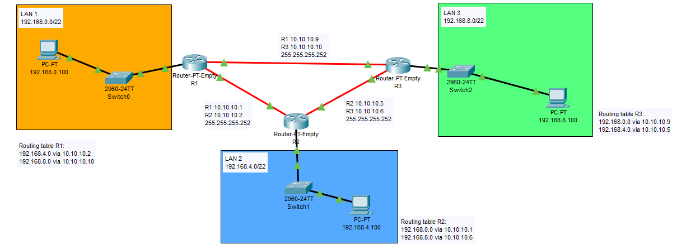

# Zadanie 1

Organizacja planuje rozpoczęcie działalności w 3 budynkach, w każdym z nich przewiduje do 1000 urządzeń IP

1. Zaprojektuj oraz udokumentuj prototyp rozwiązania z wykorzystaniem oprogramowania ``CISCO Packet Tracer``, ``VirtualBox`` lub podobnego. 

## Schemat

## Zawartość

 * Adresy poszczególnych sieci IP
 * Adresację linków pomiędzy routerami
 * Tablice routingów na poszczególnych routerach
 
 | Siec   | Adres sieci | Host min     | Host max      | Adres rozgłoszeniowy |
| -------------     |:-------------: | -----:       | -----:        | -----:    |
|   LAN1       | 192.168.0.0 | 192.168.0.1   | 192.168.3.254 | 192.168.3.255  |
|   LAN2     | 192.168.4.0 |   192.168.4.1  | 192.168.7.254 | 192.168.7.255 |
|   LAN3   | 192.168.8.0 | 192.168.8.1 | 192.168.11.254 | 192.168.11.255 |
 
 
