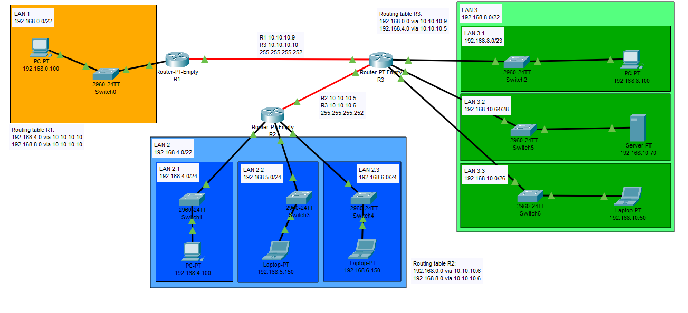

# Zadanie 2

Projekt sieci spełnił oczekiwania, organizacja po uwzględnieniu nowych wymogów chce podzielić dotychczasowe sieci na kilka podsieci.

1. Zaprojektuj oraz udokumentuj prototyp rozwiązania z wykorzystaniem oprogramowania ``CISCO Packet Tracer``, ``VirtualBox`` lub podobnego. 

## Schemat

## Charakterystyka
  * LAN 1 pozostaje bez zmian
  * LAN 2 zostaje podzielony na 3 równe podsieci
  * LAN 3 zostaje podzielony na 3 podsieci z uwzględnieniem
    * podsieć 1 ma obsłużyć do 512 hostów
    * podsieć 2 ma obsłużyć do 10 hostów
    * podsieć 3 ma obsłużyć do 32 hostów
  * Usunięty został również link pomiędzy Routerem (LAN 1) a Routerem (LAN 2)
  * Uwzględnij zmiany w tablicy routingów

## Zawartość

 * Adresy poszczególnych sieci IP
 * Adresację linków pomiędzy routerami
 * Tablice routingów na poszczególnych routerach
 
 | Siec   | Adres sieci | Host min     | Host max      | Adres rozgłoszeniowy |
| -------------     |:-------------: | -----:       | -----:        | -----:    |
|   LAN1       | 192.168.0.0 | 192.168.0.1   | 192.168.3.254 | 192.168.3.255  |
|   LAN2     | 192.168.4.0 |   192.168.4.1  | 192.168.7.254 | 192.168.7.255 |
|   LAN3   | 192.168.8.0 | 192.168.8.1 | 192.168.11.254 | 192.168.11.255 |

LAN2

| Podsiec   | Adres podsieci | Host min     | Host max      | Adres rozgłoszeniowy |
| -------------     |:-------------: | -----:       | -----:        | -----:    |
|   LAN2.1       | 192.168.4.0 | 192.168.4.1   | 192.168.4.254 | 192.168.4.255  |
|   LAN2.2    | 192.168.5.0 |   192.168.5.1  | 192.168.5.254 | 192.168.5.255 |
|   LAN2.3   | 192.168.6.0 | 192.168.6.1 | 192.168.6.254 | 192.168.6.255 |
 
 LAN3

| Podsiec   | Adres podsieci | Host min     | Host max      | Adres rozgłoszeniowy |
| -------------     |:-------------: | -----:       | -----:        | -----:    |
|   LAN3.1       | 192.168.8.0 | 192.168.8.1   | 192.168.9.254 | 192.168.9.255  |
|   LAN3.2    | 192.168.10.64 |   192.168.10.65  | 192.168.10.78 | 192.168.10.79 |
|   LAN3.3   | 192.168.10.0 | 192.168.10.1 | 192.168.10.62 | 192.168.10.63 |

 
 
