# Zadanie 1

Organizacja planuje ulepszyć działanie istniejącej sieci biurowej.

1. Zaprojektuj oraz udokumentuj konfigurację prototypu rozwiązania z wykorzystaniem oprogramowania ``VirtualBox`` lub podobnego. 

## Schemat

## Wymagania

W sieci pracują komputery biurowe oraz urządzenia siecowe współdzielące zasoby. Do tej pory organizacja borykała się z ręczna konfiguracją urządzeń oraz adresami IP które dla ludzi z poza kadry technicznej były niezrozumiałe. Postanowiono:

* Wykorzystać usługę DHCP do nadawania adresów w sposób automatyczny dla wszystkich stacji roboczych
* Serwer oraz durządzenia IP tj: drukarka muszą posiadać stałe adresy celem zminimalizowanai potrzeby rekonfiguracji ustawiań klientów
* Wprowadzić translację pomiędzy Adresami IP oraz nazwami domenowymi dla kluczowych zasobów
   - erp.mojaorganizacja.pl
   - drukarka.mojaorganizacja.pl
   - router.mojaorganizacja.pl
* Wszystkie urządzenia łączą się z siecią internet z wykorzystaniem bramy NAT
* Wykorzystać podsieć rozmiaru /22 pozwalającej zaadresować co najmniej 600 urządzeń

## Zawartość dokumentacji

 * Charakterystyka rozwiazania 
 
 Wykorzystano serwer DHCP do automatycznego przydzielania adresów z puli 192.168.100.100 - 192.168.103.254, drukarce ustawiono stały adres IP - 192.168.100.200. Serwer pełni również rolę routera o stałym adresie IP 192.168.100.1. Wprowadzono translacje adresów na nazwy domenowe dla drukarki, routera oraz erp przy użyciu serwera DNS, by były bardziej zrozumiałe dla przeciętnego użytkownika. Cała sieć 192.168.100.0/22 łączy się z siecią rozległą przy wykorzystaniu bramy NAT.
 
 * Adresy sieci IP
 
 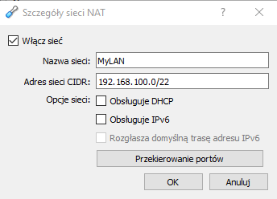
 
 * Oprogramowanie wykorzystane do realizacji poszczególnych wymagań
 
      * serwer DHCP - dhcpd
      * serwer DNS - dnsmasq
      * brama NAT - iptables
      
 * Kluczowa konfiguracja oprogramowania pozwalająca na odtworzenie stanu po reinstalacji środowiska
    1. Konfiguracja NAT z iptables
    
    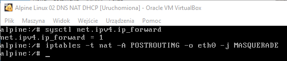
    
    2. Konfiguracja DHCP
    
    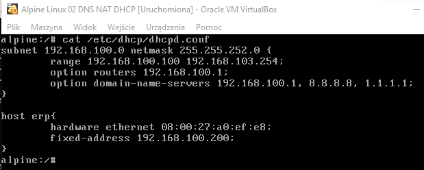
    
    3. Konfiguracja DNS
    
    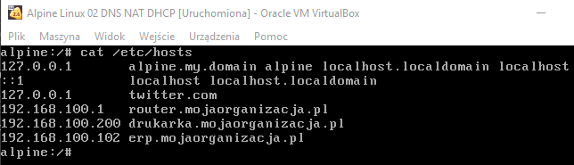
    
    4. Konfiguracja interfejsów sieciowych
    
    SERWER
    
    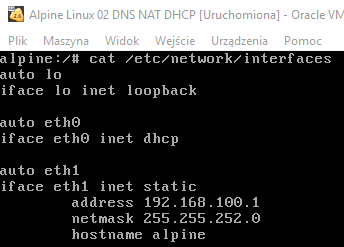
    
    DRUKARKA
    
    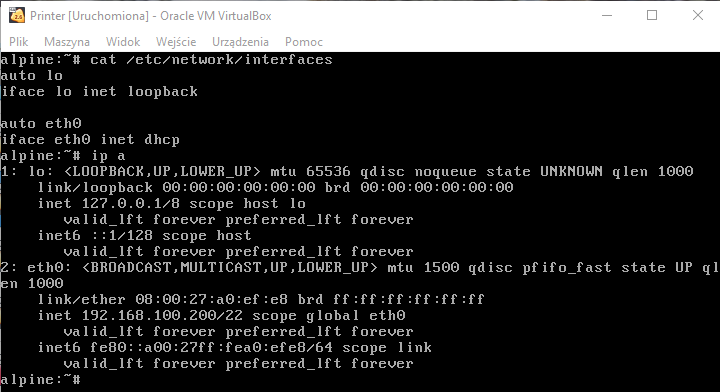
    
    URZĄDZENIE 1
    
    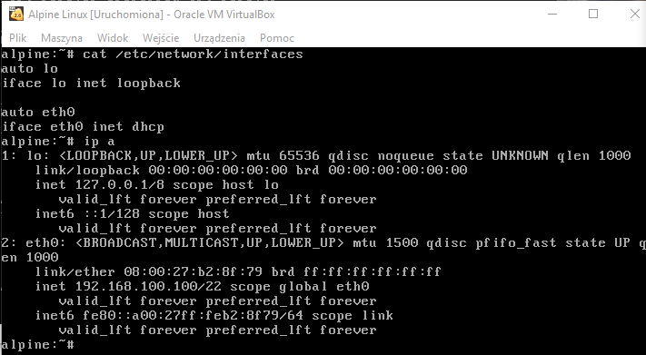
    
    URZĄDZENIE 2
    
    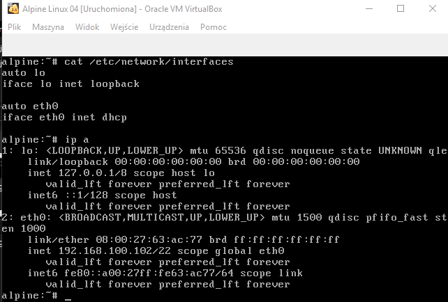
    
    5. Efekty
    
    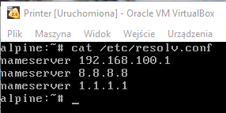
    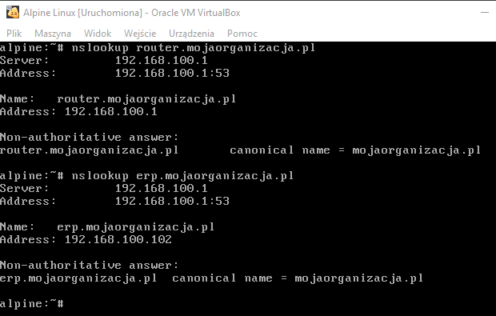
    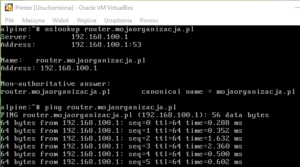
    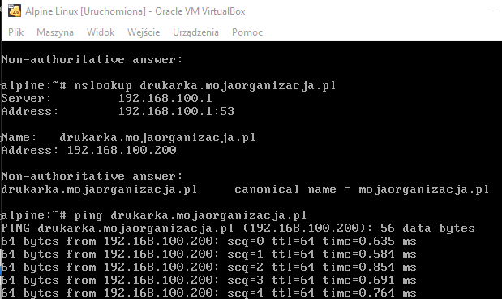
    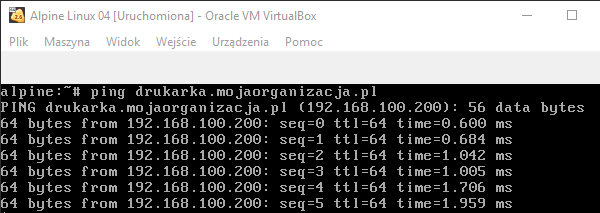
    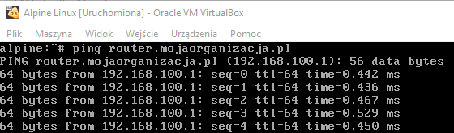
    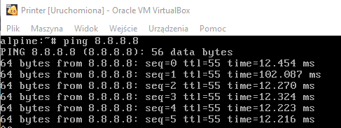
    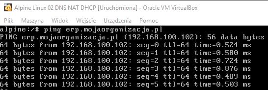

